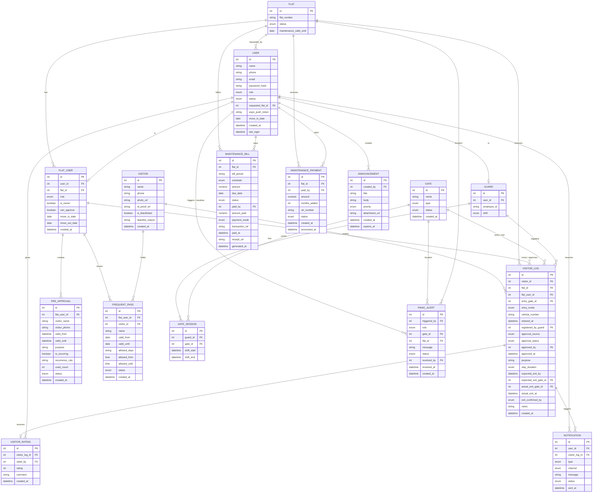

# RM2 VMS - Entity Relationship Diagram

```mermaid
erDiagram
    GATE {
        int id PK
        string name
        enum type
        enum status
        datetime created_at
    }

    FLAT {
        int id PK
        string flat_number
        enum status
        date maintenance_valid_until
    }

    USER {
        int id PK
        string name
        string phone
        string email
        string password_hash
        enum role
        enum status
        int requested_flat_id FK
        string expo_push_token
        date move_in_date
        datetime created_at
        datetime last_login
    }

    FLAT_USER {
        int id PK
        int user_id FK
        int flat_id FK
        enum role
        boolean is_owner
        boolean can_approve
        date move_in_date
        date move_out_date
        datetime created_at
    }

    GUARD {
        int id PK
        int user_id FK
        string employee_id
        enum shift
    }

    VISITOR {
        int id PK
        string name
        string phone
        string photo_url
        string id_proof_url
        boolean is_blacklisted
        string blacklist_reason
        datetime created_at
    }

    VISITOR_LOG {
        int id PK
        int visitor_id FK
        int flat_id FK
        int flat_user_id FK
        int entry_gate_id FK
        enum entry_mode
        string vehicle_number
        datetime entered_at
        int registered_by_guard FK
        enum approval_source
        enum approval_status
        int approved_by FK
        datetime approved_at
        string purpose
        enum stay_duration
        datetime expected_exit_by
        int expected_exit_gate_id FK
        int actual_exit_gate_id FK
        datetime actual_exit_at
        enum exit_confirmed_by
        string notes
        datetime created_at
    }

    PRE_APPROVAL {
        int id PK
        int flat_user_id FK
        string visitor_name
        string visitor_phone
        datetime valid_from
        datetime valid_until
        string purpose
        boolean is_recurring
        string recurrence_rule
        int used_count
        enum status
        datetime created_at
    }

    FREQUENT_PASS {
        int id PK
        int flat_user_id FK
        int visitor_id FK
        string name
        date valid_from
        date valid_until
        string allowed_days
        time allowed_from
        time allowed_until
        enum status
        datetime created_at
    }

    VISITOR_RATING {
        int id PK
        int visitor_log_id FK
        int rated_by FK
        int rating
        string comment
        datetime created_at
    }

    NOTIFICATION {
        int id PK
        int user_id FK
        int visitor_log_id FK
        enum type
        enum channel
        string message
        enum status
        datetime sent_at
    }

    GATE_SESSION {
        int id PK
        int guard_id FK
        int gate_id FK
        datetime shift_start
        datetime shift_end
    }

    PANIC_ALERT {
        int id PK
        int triggered_by FK
        enum role
        int gate_id FK
        int flat_id FK
        string message
        enum status
        int resolved_by FK
        datetime resolved_at
        datetime created_at
    }

    MAINTENANCE_BILL {
        int id PK
        int flat_id FK
        string bill_period
        enum schedule
        numeric amount
        date due_date
        enum status
        int paid_by FK
        numeric amount_paid
        enum payment_mode
        string transaction_ref
        datetime paid_at
        string receipt_url
        datetime generated_at
    }

    MAINTENANCE_PAYMENT {
        int id PK
        int flat_id FK
        int paid_by FK
        numeric amount
        int months_added
        string utr_number
        enum status
        datetime created_at
        datetime processed_at
    }

    ANNOUNCEMENT {
        int id PK
        int created_by FK
        string title
        string body
        enum priority
        string attachment_url
        datetime created_at
        datetime expires_at
    }

    %% Relationships
    FLAT ||--o{ USER : "requested_by"
    FLAT ||--o{ FLAT_USER : "has"
    USER ||--o| FLAT_USER : "is"
    USER ||--o| GUARD : "is"

    VISITOR ||--o{ VISITOR_LOG : "makes"
    FLAT ||--o{ VISITOR_LOG : "receives"
    FLAT_USER ||--o{ VISITOR_LOG : "hosts / approves"
    GATE ||--o{ VISITOR_LOG : "entry / exit"
    GUARD ||--o{ VISITOR_LOG : "registers"

    FLAT_USER ||--o{ PRE_APPROVAL : "creates"
    FLAT_USER ||--o{ FREQUENT_PASS : "issues"
    VISITOR ||--o{ FREQUENT_PASS : "holds"

    VISITOR_LOG ||--o| VISITOR_RATING : "receives"
    USER ||--o{ VISITOR_RATING : "gives"

    USER ||--o{ NOTIFICATION : "receives"
    VISITOR_LOG ||--o{ NOTIFICATION : "triggers"

    GUARD ||--o{ GATE_SESSION : "works"
    GATE ||--o{ GATE_SESSION : "has"

    USER ||--o{ PANIC_ALERT : "triggers / resolves"
    GATE ||--o{ PANIC_ALERT : "location"
    FLAT ||--o{ PANIC_ALERT : "location"

    FLAT ||--o{ MAINTENANCE_BILL : "billed"
    USER ||--o{ MAINTENANCE_BILL : "pays"
    FLAT ||--o{ MAINTENANCE_PAYMENT : "receives"
    USER ||--o{ MAINTENANCE_PAYMENT : "pays"

    USER ||--o{ ANNOUNCEMENT : "creates"
```
